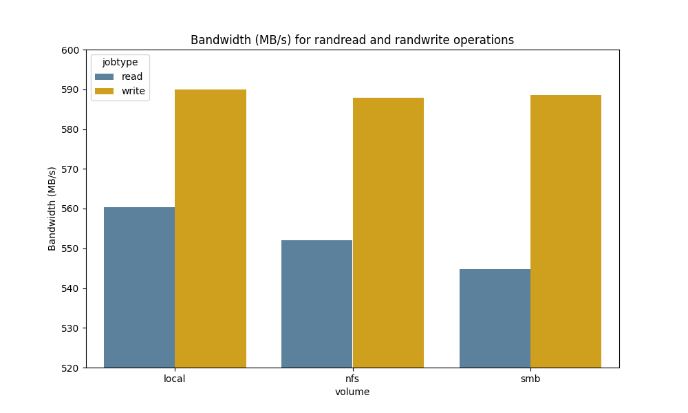
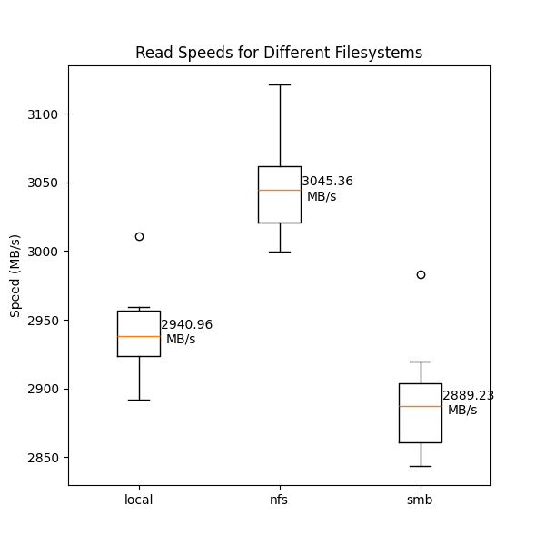
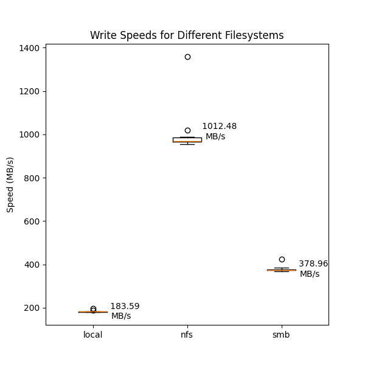

# Storage Performance Testing

Test the performance of storage systems using the Flexible I/O Tester (fio) and
Python for visualisation. Quicky put together, don't trust too much.

## Requirements

### Software

- [fio](https://fio.readthedocs.io/en/latest/): Install it on Ubuntu with `sudo apt install fio`.

- [Python 3](https://www.python.org/downloads/)

### Python Libraries

- [pandas](https://pandas.pydata.org/)
- [matplotlib](https://matplotlib.org/)
- [seaborn](https://seaborn.pydata.org/)
- [tqdm](https://github.com/tqdm/tqdm/)

Install these in a new Python environment 
(say `pip install pandas matplotlib seaborn`)

## Getting Started

### Using fio

1. Install the required software and Python libraries.

2. `cd` into the repository folder and run the `benchmark.sh` script to generate
   the data. The script will run a series of fio tests and save the results in
   json files. Do this once for each volume you want to test.



```bash
bash benchmark.sh /path/to/directory
```
> Note: The script will create a new directory in the *current* directory and save
the results there.

3. Use the provided Python script `process-benchmark.py` to analyze the data and generate
   visualizations.

### Using the os module

1. Install the required software and Python libraries.
2. Run the 'iotest.py' script to generate the data and plots. These show
   sequential read and write speeds (see script for details).




